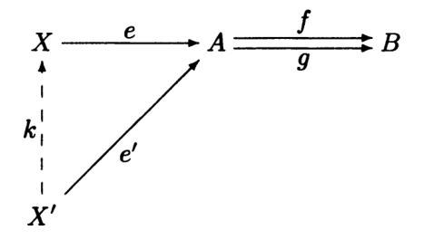

- An arrow $e\colon X\to A$ is an _equalizer_ of a pair of arrows
  $f, g\colon A\to B$ if:

  1. $f\circ e = g\circ e$
  2. Whenever $e'\colon X'\to A$ satisfies $f\circ e' = g\circ e'$, there exists
     unique $k\colon X'\to X$ such that $e\circ k = e'$

  

- This is another example of a
  [[Universal Constructions|universal construction]]
