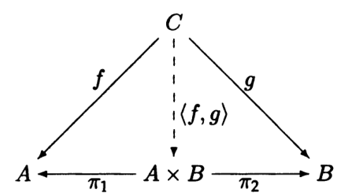

- A _product_ of two objects $A$ and $B$ is the object $A\times B$, with two
  _projection arrows_ $\pi_1\colon A\times B\to A$ and
  $\pi_2\colon A\times B\to B$, such that for any object $C$ with arrows
  $f\colon C\to A$ and $g\colon C\to B$, there is exactly one _mediating arrow_
  $\langle f, g\rangle\colon C\to A\times B$ that makes the following diagram
  commute: 
  - We can kind of think of the projection mappings as necessitating that
    $A\times B$ is "big enough" to project onto $A$ and $B$
  - The condition that for all $C$ with the $f, g$ arrows enforces that
    $A\times B$ is the "smallest" object capable of projecting onto $A$ and $B$
  - In the case of $\mathbf{Set}$, $A\times B$ is the "smallest" set with enough
    information to have projections onto $A$ and $B$
- If a category has a product $A\times B$ for every pair of objects $A$ and $B$,
  then we say that it has all (binary) products, or has products
- **Note**: The projection arrows are still a part of the definition of the
  product
  - Useful when we talk about a more general construction called
    [[Limits|limits]]
- Coproducts are products in the dual category
