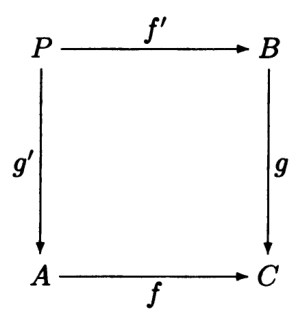
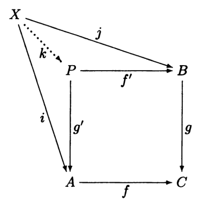

- A _pullback_ of a pair of arrows $f\colon A\to C$ and $g\colon B\to C$ is an
  object $P$ and a pair of arrows $g'\colon P\to A$ and $f'\colon P\to B$ such
  that $f\circ g = g\circ f'$

  

  and if $i\colon X\to A$ and $j\colon X\to B$ satisfy $f\circ i = g\circ j$,
  then there exists a unique $k\colon X\to P$ making the following diagram
  commute:

  

- We say that $f'$ is a pullback (or inverse image) of $f$ along $g$, and $g'$
  is a pullback of $g$ along $f$
  - Note that the pullback itself consists of both $f', g'$, as well as the
    object $P$
