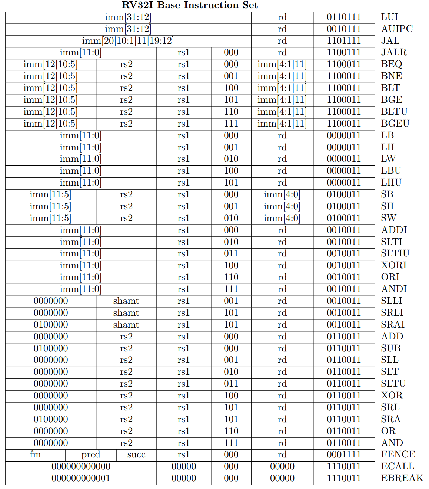

- The role of the assembler is to convert assembly (e.g. [[RISC-V]]
  instructions) to binary using a table
- Each instruction is broken up into many regions that help identify the
  instruction
- Types of instructions:
  - R: Register
  - I: Immediate
  - S: Immediate
  - B: Immediate
  - U: Immediate
  - J: Immediate

- Rightmost is opcode, shows types of instructions (e.g. branch, arithmetic,
  etc.)
- Each register takes up 5 bits of storage, since we have 32 registers
  - $\log_2(32) = 5$
  - Some instructions don't require registers, and so we reuse those bits for
    immediates
- The `funct3` bits distinguish instructions within each category (e.g. `addi`
  vs. `ori`)
  - Some instructions don't need to disambiguate, and the extra 3 bits are
    reused for other purposes (e.g. increasing size of immediate)
- The `funct7` bits is used for minor disambiguation, but isn't really used that
  much otherwise
- Immediates are packed in wherever we can put them
