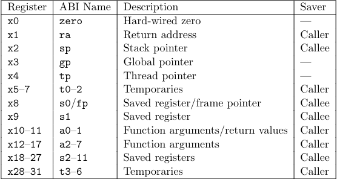

- To properly maintain the registers in [[RISC-V]], there is a contract imposed
  on function callers/callees regarding register management
- Callees:
  - Save necessary registers/restore them after the function call
  - Save the return address via [[Linking|linking]]
  - Recover the frame pointer before returning
  - Put the return value of the function into a register (to communicate across
    function calls)
- Callers:
  - Put function arguments onto stack
  - Invoke the function (jump instruction)

