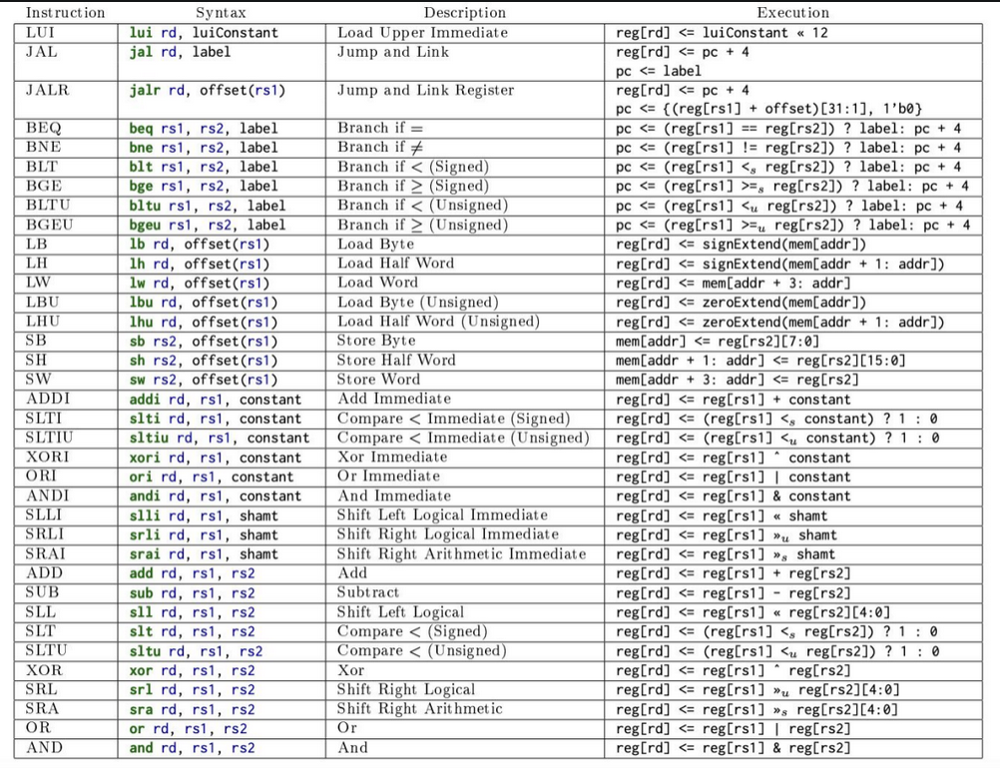

- RISC-V is an open source [[Instruction Set Architecture|ISA]]
- It is the 5th generation of [[Reduced Instruction Set Computation|RISC]]

## Instructions

- Each instruction is composed of a command, and some operands (up to 2)
- Each operand can be a:
  - Register: Fast memory _in the processor_ used to access data
    - Larger registers offer better cache locality/performance, but at worse
      power efficiency/physical area on the CPU
  - Immediate: Constant value (smaller than 32-bit)
  - Memory address

## Registers

- There are 32 registers, each 32-bit (1 word)
- They are named $x_0$ through $x_{31}$
  - $x_0$ is hardwired to 0 (ground)
- They are stored in a [[Register File|register file]]
- Higher-end systems (not covered in this class) also have separate registers
  for dealing with floating point values, e.g. $f_0, f_1,\dotsc$

## Immediates

- Constant values
- Immediates aren't 32-bit because there isn't enough space
  - This is because each _instruction_ is 32 bits, and we need 5 bits per
    register ($\log_2(32) = 5$) and a few more bits to indicate which operation
    we are performing
  - When doing computation with immediates and register values, we need to
    perform sign extensions

## Memory

- Should be byte-addressable
- Should support two main operations:
  - Load: Reading from memory
  - Store: Writing to memory
- Usually addressed as some base value + some offset
- It is encoded via little endian, and values are loaded/stored in 1-word chunks
  (4 bytes)
