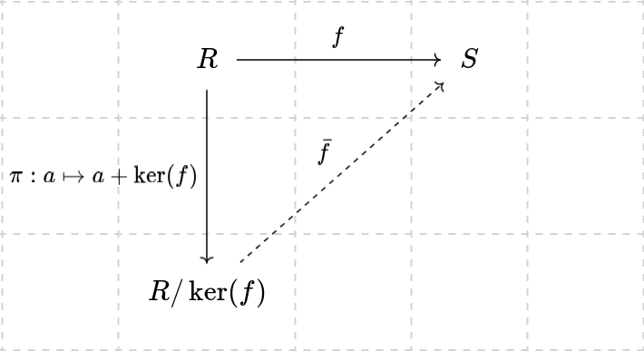

- **Theorem**: Let $f\colon R\to S$ be a ring homomorphism. The following hold:

  1. There exists a unique homomorphism $\bar f\colon R / \ker(f)\to S$ such
     that $f = \bar f\circ \pi$
  2. $R / \ker(f)\cong \mathrm{Im}(f)$

  In other words, there exists a unique arrow $\bar f$ such that this diagram
  commutes: 

**Proof**: We define $\bar f$ by $a + \ker(f)\mapsto f(a)$.

- We first show that this mapping is a well-defined function.
